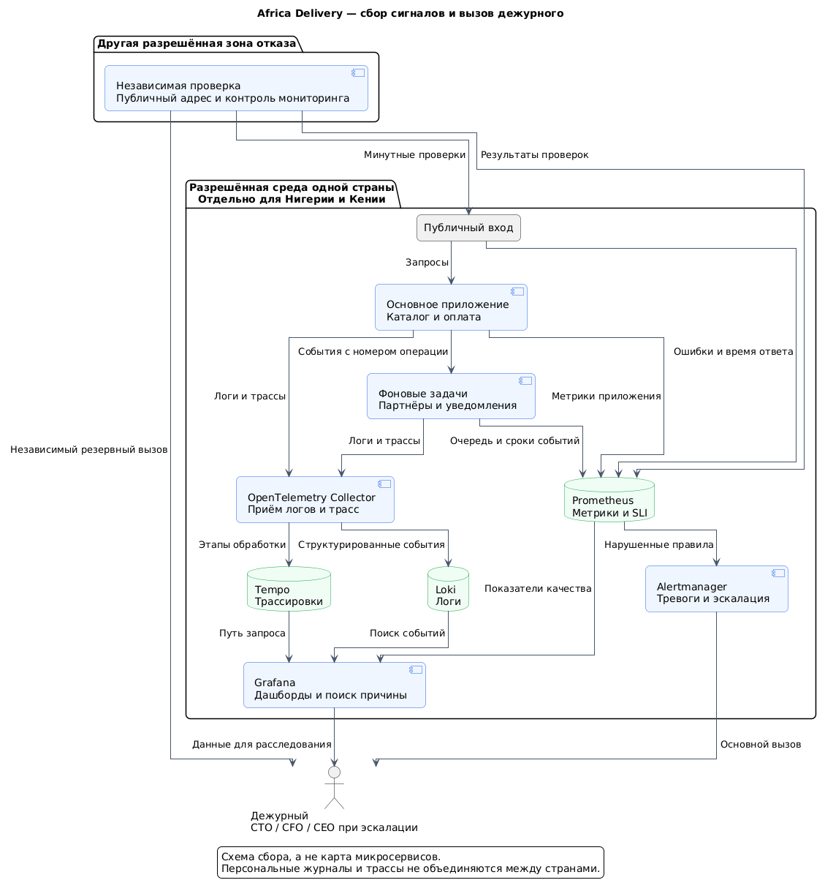

# Наблюдаемость: как узнаём о сбое и находим причину

Наблюдаемость нужна, чтобы дежурный мог ответить на три вопроса: что нарушено, где проблема и какое действие безопасно. Метрики показывают масштаб, логи — отдельные события, трассировка — путь обработки запроса.

## Четыре золотых сигнала

Основа — [Google SRE: четыре золотых сигнала](https://sre.google/sre-book/monitoring-distributed-systems/). Конкретные метрики и пороги ниже предложены для Africa Delivery.

| Сигнал | Что измеряем | Как используем |
|---|---|---|
| Трафик | Запросы/с каталога и оплаты; события уведомлений/с; вызовы каждого партнёра | Сравниваем с нагрузкой NFR-08; отсутствие трафика не считаем доказательством здоровья |
| Задержка | P99 запросов; доля быстрых успешных ответов; время до итога оплаты; возраст самого старого неотправленного сообщения | Проверяем сроки 1/1,5/60/300 с; быстрый ошибочный ответ не улучшает показатель качества |
| Ошибки | Неуспешные запросы, тайм-ауты, неподтверждённые оплаты, просроченные сообщения, повторные финансовые действия | Различаем нашу систему, PSP и канал доставки; деньги имеют нулевой допуск к дублям |
| Насыщение ресурсов | CPU, память, место на диске, занятые соединения БД, очередь задач, отставание резервной БД | Видим риск перегрузки до общего отказа; разделяем ресурсы фоновых задач и оплаты |

Процент ошибок всегда показываем вместе с числом запросов/событий. При малом объёме один отказ может дать большой процент; реальный финансовый дубль остаётся критичным даже при единственной операции.

## Как метрики связаны с SLI

Имена ниже — договорённость для реализации. Страна, операция, партнёр, канал и результат — небольшие фиксированные группы. Номера покупателей и заказов не становятся метками метрик.

| Метрика / источник | Что рассчитывается | Документ и требование |
|---|---|---|
| `catalog_requests_total`, результат good/bad на публичном входе | Доля корректных ответов каталога | [Контракт каталога: SLI](slo/catalog.md#sli--что-и-как-измеряем), NFR-01 |
| `payments_requests_total`, good/bad после проверки записи | Доля корректно обработанных собственных запросов | [Контракт оплаты: SLI](slo/payments.md#sli--что-и-как-измеряем), NFR-02 |
| `service_probe_success`, одна плановая проверка в минуту | Доступность по времени, независимо от пользовательского трафика | Контракты каталога/оплаты, NFR-01/02 |
| `http_request_duration_seconds`, интервалы времени ответа | P99; доля запросов, одновременно успешных и быстрее 1/1,5 с | NFR-06; контракты каталога/оплаты |
| БД попыток: время начала, подтверждения и итог | Доля достоверных итогов до 300 с | [Контракт оплаты](slo/payments.md), NFR-03 |
| БД событий: время возникновения, приёма и квитанции | Доли передачи до 60 с и доставки до 300 с | [Контракт уведомлений](slo/notifications.md), NFR-04/05 |
| `financial_duplicate_effects_total` и ежедневная сверка | Число повторных финансовых действий и расхождений | NFR-11; немедленная тревога при дубле |
| `oldest_notification_age_seconds`, `recoverable_point_age_seconds` | Возраст очереди и доступной точки восстановления | NFR-04/10; предотвращение нарушения срока |
| `cache_age_seconds`, `catalog_version_age_seconds` | Срок жизни и доверие к копии | NFR-13; [ADR-002](adr-002-caching-strategy.md) |

Для простой доли: **успешные события / все учитываемые события × 100%**. Отказы нашей системы и партнёра не исключаются из полного бизнес-пути.

Итоги оплаты и доставки рассчитываются по событиям из БД с учётом сроков созревания, описанных в контрактах. Простое количество входящих сообщений партнёра не является правильным знаменателем. Фоновый расчёт обновляет показатели раз в минуту; отсутствие обновления вызывает отдельную тревогу.

Для P99 храним интервалы времени ответа, а не усредняем готовые P99 разных серверов. Тайм-ауты учитываем в доле неуспешных/небыстрых запросов; быстрые отказы не должны скрывать проблему.

## Логи — история отдельного события

Приложение и фоновые процессы пишут структурированные записи: время UTC, страна, компонент, тип события, результат, технический номер операции и trace ID. Trace ID — номер, связывающий этапы одного запроса.

Примеры событий: платёжная заявка записана, сообщение PSP проверено, повтор распознан, уведомление принято, квитанция получена, переключение БД началось/закончилось. Для повтора фиксируем отсутствие повторного эффекта.

Не записываем пароли, токены, номера карт, содержимое сообщений и телефонные номера. Псевдоним операции всё ещё может быть связан с человеком: доступ ограничивается, размещение остаётся национальным. Финансовый журнал в БД не заменяется обычными диагностическими логами.

Диагностические логи предлагаем хранить 14 дней, трассировки — 7 дней, метрики — 30 дней. Срок финансового учёта утверждается отдельно CFO и юристом. Эти сроки — эксплуатационные оценки, не требования закона.

## Распределённая трассировка

OpenTelemetry связывает входной запрос, обращение к БД, сохранённое событие, фоновую задачу и вызов партнёра. Trace ID переносится в событии; повторная попытка отмечается новым этапом той же операции.

Платёжный webhook может прийти позже и без исходного trace ID. Связываем его с операцией внутри своего журнала; не предполагаем, что внешний партнёр поддерживает нашу трассировку.

Предлагаем сохранять все ошибочные/медленные трассы и 10% остальных после краткого ограниченного буфера. Метрики SLI и финансовый журнал собираются полностью; выборочная запись применяется только к трассам. При недостатке ресурсов ограничивается диагностика, а не финансовый учёт; потеря диагностических данных видна отдельной метрикой. Трассы не содержат платёжных реквизитов или текста SMS.

## Схема сбора и инструменты

[Исходник PlantUML](observability.puml).

| Инструмент | Задача |
|---|---|
| Prometheus | Сбор числовых метрик и расчёт правил тревог |
| Grafana | Дашборды SLI/SLO, ресурсы, переход к логам и трассам |
| OpenTelemetry Collector | Приём и ограниченная передача логов/трассировок |
| Loki | Поиск диагностических логов |
| Tempo | Хранение и просмотр трассировок |
| Alertmanager | Группировка тревог, вызов дежурного и эскалация |
| Независимая внешняя проверка | Проверка публичного адреса и контроль работы самого мониторинга |

Сбор и хранение дублируются по странам. Независимые проверки работают в другой разрешённой зоне отказа; контролируют и пропуск сигнала мониторинга. Резервный вызов дежурного не использует тот же шлюз, который отправляет сообщения покупателям.

Общий дашборд CEO содержит только разрешённые агрегаты: доступность, число заказов, оплаты и очередь. Логи и персональные записи не объединяются между странами без разрешения.

## Что считается инцидентом

| Уровень / условие | Кому и когда | Первые безопасные действия |
|---|---|---|
| Критичный: двойное финансовое действие или ложное «оплачено» | Дежурный, CTO и CFO немедленно | Остановить затронутые операции; сохранить доказательства; сверить номера и суммы; не повторять списание |
| Критичный: две плохие минутные проверки подряд | Дежурный после 2 мин; подтверждение ≤5 мин | Проверить публичный вход, копии приложения и БД; откатить плохой выпуск или переключить проверенный резерв |
| Критичный: >5% ошибок за 5 мин, не менее 100 запросов | Дежурный сразу после окна | Разделить собственные ошибки и партнёра; ограничить неисправные вызовы |
| Критичный: точка восстановления старше 15 мин либо пропал внешний контроль >2 мин | Дежурный и CTO | Проверить копии/журнал, ключи и независимый сигнал; не считать систему доказанно защищённой |
| Критичный: весь канал не принимает нужные сообщения 2 мин | Дежурный при наличии ожидающих сообщений | Проверить фоновый процесс и шлюз; сохранить события; включить допустимый резерв |
| Обычный: одно уведомление просрочено или итог оплаты неизвестен >300 с | Оператор; повторяющаяся проблема — CTO | Проверить прежнюю операцию; связаться допустимым каналом; не создавать новую оплату вслепую |
| Обычный: P99 выше цели 15 мин, ресурс >80% 15 мин, прогноз расходов >$4 500/мес | CTO; расходы — CFO | Найти узкое место, проверить объём, память и пулы; оценить увеличение мощности до расхода |

Быстрое расходование бюджета SLO также вызывает дежурного: доля плохих запросов >1,44% одновременно за 1 час и 5 минут либо >0,6% за 6 часов и 30 минут. Это пороги для цели 99,9%; для уведомлений делим долю нарушений на их собственный бюджет 0,5%/2% и используем те же множители 14,4/6. Процентные тревоги применяем при достаточном объёме — минимум 100 событий в каждом окне. При малом объёме работают минутные проверки, возраст событий и финансовые правила.

За 5 минут без подтверждения вызова подключается CTO. CEO получает уведомление о критичном инциденте не позднее 10 минут; CFO — при денежном риске или превышении бюджета. Статус обновляется каждые 30 минут, разбор причин — до двух рабочих дней. После исчерпания SLO-бюджета обычные изменения приостанавливаются.

## Общие правила защиты от каскадного отказа

Каждый партнёр получает отдельный предел соединений и очередь — Bulkhead. Вызов ограничен 5 с. После пяти последовательных сетевых отказов или тайм-аутов Circuit Breaker прекращает новые вызовы на 30 с, затем допускает одну проверочную попытку.

Retry с backoff: всего не более трёх попыток с увеличением и случайным разбросом пауз. Повторные вызовы занимают не более 10% согласованного общего лимита партнёра, а весь поток остаётся внутри лимита. Если ресурса нет, событие сохраняется и ждёт; пропуск срока остаётся нарушением SLO. Запрос списания повторяется только при проверенной защите PSP от дубля.

## Проверка до запуска

Остановить приложение, отключить PSP/шлюз, повторить платёжные сообщения, заполнить очередь, потерять связь с БД, отключить мониторинг и независимый канал вызова по отдельности. Для каждого испытания сохранить метрики, время вызова, действия и результат. Дашборд не заменяет эти доказательства.

Источники: [Task2, Architecture Vision, раздел 2 «Устройство системы и ответственность»](../Task2/architecture-vision.md#2-устройство-системы-и-ответственность); [раздел 3 «Данные, переносимость и качество»](../Task2/architecture-vision.md#3-данные-переносимость-и-качество); [артефакт 5, с. 2: наблюдаемость](reference-guide.md#исходные-письма). Методики: [OpenTelemetry](https://opentelemetry.io/docs/concepts/signals/), [Google SRE: тревоги по SLO](https://sre.google/workbook/alerting-on-slos/).

## Assumptions

- Инструменты открытые, но их машины, хранение и эксплуатация не бесплатны. План $350/мес для диагностики проверяется офертами и ограничениями объёма, как и [весь бюджет доступности](availability-strategy.md).
- Есть расписание основного и резервного дежурного, согласованные контакты и независимый способ вызова. Шесть человек дают дежурство с вызовом, не постоянную круглосуточную смену.
- Пороги тревог, сроки хранения, число повторов и доля сохранённых трасс — предложения автора. CTO проверяет их нагрузкой, юридический ответственный — размещением и сроками.
- Общие лимиты API партнёров неизвестны; без их подтверждения настройки повторов и пулы не считаются готовыми.
