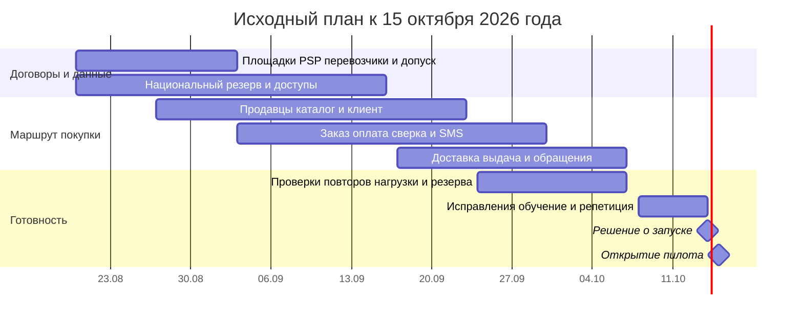

# Roadmap: восемь недель до MVP и развитие до года

**Цель:** открыть 15 октября безопасный пилот Нигерии и Кении, затем расширять общий продукт. Объём — [8 сокращённых пунктов из 29](mvp-scope.md), шесть контракторов, $5 000/месяц регулярной техники на первые шесть месяцев. Финансирование труда и разовых проверок требуется отдельно.

## Календарь и фактическая готовность

Восемь недель перед 15 октября 2026 года — **20 августа–14 октября**. Сегодня 8 октября: это последняя неделя такого плана. В источниках нет отчёта о выполнении предыдущих семи недель. Поэтому таблица ниже — исходный план, который нужно сверить с действительными результатами, а не восемь новых недель с сегодняшнего дня.

Если разработка действительно начинается с нуля 8 октября, восемь недель заканчиваются **3 декабря**, а не 15 октября. Сохранить оба обещания невозможно. CEO/инвестор должны выбрать другой срок либо отдельно согласованное ограниченное событие без реальных платежей/персональных данных; такое событие не называется работающим MVP. Это продолжает [Task2, ADR №1, раздел «Контекст»](../Task2/adr-001-architecture-style.md#контекст).

Юридическое письмо датировано 8 августа: его 4–6 недель означали примерно **5–19 сентября**, а не новый срок ожидания с октября. CEO проверяет, получено ли заключение; если нет, эскалирует просрочку. До допуска конкретной страны используем только тестовые данные и не принимаем реальные платежи.

Месяцы считаем от начала работ 20 августа: месяц 1 заканчивается 16 сентября (первая половина восьминедельного плана), месяц 2 — 14 октября; календарные контрольные точки месяца 6/12 — 19 февраля/19 августа 2027 года. Первые шесть месяцев бюджетного ограничения в этом плане — до 19 февраля. CFO подтверждает начало этого окна; расчёт не маскирует переносом даты превышение расходов.

## Четыре контрольные точки

| Точка | Объём и результат | Команда | Регулярная техника, все страны вместе | Проверка перед переходом |
|---|---|---|---|---|
| **Месяц 1, 16.09.2026** | Основные и резервные национальные среды; продавцы/каталог/заказ; тестовые M-Pesa/Flutterwave; SMS; простой кабинет и операторская панель. 10 продавцов/500 товаров для сквозной проверки | 6 контракторов; CEO владелец продукта; CTO/архитектор руководят. Местные операторы — по партнёрскому договору | **$3 650/мес**, живых заказов пока нет | Подписаны/проверены площадки и каналы, есть правовая позиция, платёжные кабинеты и покрытие доставки. Реальная оплата только после допуска |
| **Месяц 2, 14.10; открытие 15.10.2026** | 100 проверенных продавцов/5 000 товаров; 8 сокращённых пунктов PM; заказ, оплата, SMS, выдача, обращение/возврат, сводка CEO. Безопасная проверка кеша/повторов/резерва | Те же 6; до 60 дней общей ёмкости на исправления/поддержку. CTO утверждает дежурства; CEO назначает местных операторов | **$3 950/мес** при 2 000 заказов; потолок **$5 000** | Все критерии запуска ниже подтверждены отдельно для NG и KE |
| **Месяц 6, 19.02.2027** | Устойчивый пилот двух стран, кабинет продавца, простой поиск, текстовые отзывы, статусы перевозчика, улучшенные возвраты. Проверка WhatsApp/USSD и доступной выдачи. ЮАР подготовлена: право, локальные данные, партнёры, испытание; продуктивный запуск после отдельного бюджета | **6 контракторов при действующей заморозке**. CEO обеспечивает местное обслуживание партнёрами. Дополнительный найм только отдельным решением | Базовый пилот **$3 950**; при росте до 9 000 заказов — **$5 000**. Неподтверждённые затраты ЮАР не добавляются внутри лимита | Обработка обращений не выходит за согласованный срок; нагрузка/восстановление проверены. CFO утверждает бюджет месяцев 7–12 и отдельную смету ЮАР |
| **Месяц 12, 19.08.2027** | **Цель — 5 стран:** NG/KE/ZA и две страны, выбранные после проверки. English/French и нужные местные языки; ограниченный B2B; возвраты и track & trace; пилот видео только после допуска. Большинство развлекательных/финансовых функций всё ещё вне объёма | 6 контракторов + существующее руководство + оплачиваемые национальные партнёры. Требуется отдельная проверка ёмкости; если шести недостаточно, CEO разрешает найм либо уменьшает объём/число стран | Плановый ориентир Task2: **$12 200 фиксированных + $0,15/заказ**; при 131 333 заказах **$31 900/мес**. Цена пяти национальных схем подтверждается офертами; это не бюджет $5 000 | Продуктивная страна открывается только после её допуска, тарифа PSP, локального резерва и службы выдачи/поддержки. При отсутствии денег/людей остаётся обслуживаемый объём, а не обещание пяти стран любой ценой |

Источник цифр: [Excel Task2](../Task2/tco-model.xlsx), «Контроль», C27–C34, C46–C47; [подробная смета Task5](build-buy-partner-costs.md). $131 333 заказов/месяц — прежняя гипотеза, полученная из 800 000 заказов в первый год, а не подтверждённый спрос. Регистрации миллиона пользователей не равны миллиону заказов. Ориентир $31 900 не доказывает стоимость пяти стран: финансирование должно покрыть фактические национальные оферты и проверки.

## Работы в течение восьми недель

Полосы пересекаются, потому что работают разные исполнители. Общая ёмкость ограничена [180 днями работ и 60 днями резерва](capability-map.md#решения-и-стоимость-mvp); диаграмма не разрешает всем одновременно заняться каждым направлением. Если договоры не готовы к 3 сентября, проверка песочницы продолжается, но риск продуктивного запуска немедленно эскалируется.

## Критерии открытия 15 октября

До **12 октября** CEO/CTO предъявляют договоры и уже работающую версию, CFO — полную смету, тарифы и деньги для расчётов. Дата встречи 12 октября взята из плана [Task2, ADR №1](../Task2/adr-001-architecture-style.md); её фактическое назначение не подтверждено.

До **14 октября** команда должна доказать:

1. Реальный заказ разрешённой страны проходит от товара до выдачи; продавец допущен, наличие/цена перепроверены.
2. Оплата подтверждается только проверенным ответом; повтор/обрыв не создаёт второе списание, выплату или выдачу. Есть проверенный денежный возврат.
3. Местные данные, журналы, копии и ключи проверены; договоры партнёров законны; реклама не использует непроверенную базу номеров.
4. Испытана нагрузка на страну: каталог 100 запросов/с, оплата 5/с, уведомления 10 событий/с в течение 30 минут; пик 200/10/20 в течение 5 минут. Пределы скорости из Task3 соблюдены.
5. Общий сбой обнаруживается за 2 минуты; дежурный отвечает за 5 минут; каталог/статусы восстановлены до 60 минут, последние пригодные записи не старше 15 минут. Оплата после сбоя открывается после сверки.
6. Есть законный механизм помощи выдаче без мобильного интернета, обученные местные операторы и проверенный запасной канал. Полностью автономная выдача без какой-либо связи не обещается.
7. Регулярная техника ≤$5 000, комиссия строго ниже 2,5% с запасом; правила выплат/возвратов и ликвидность утверждены CFO. Публикация Android/магазина приложений подтверждена, если она остаётся обязательством инвестору.
8. Инвестор письменно принимает целевые 99,9% собственной платформы и безопасную паузу финансовых операций вместо исходного обещания 99,99% без деградации. CTO уточняет программу и срок CNCF по вопросу Q4 Task1; сертификат маркетплейса не объявляется полученным.

Основания: [Task3, реестр НФТ, NFR-06–11/15–20](../Task3/nfr-registry.md#реестр); [Task4, план восстановления, раздел «Что проверяем до 15 октября»](../Task4/failover-plan.md#что-проверяем-до-15-октября); [Task1, вопросы Q1/Q2/Q3/Q5](../Task1/open-questions.md).

Если страна не проходит проверку, запуск этой страны блокируется. CEO с инвестором выбирают запуск только готовой страны, перенос либо отдельную демонстрацию. Нельзя назвать демонстрацию полным пилотом NG/KE. Непроверенные платежи или незаконная передача данных не являются допустимым сокращением MVP.

## Решения после пилота

Через 90 дней CEO/CFO проверяют спрос, расходы, обращения и долю устройств. Тогда повторно оцениваются iOS, языки, flash-sales и собственный выбор нескольких платёжных маршрутов. К месяцу 6 выбираются два следующих рынка и условия B2B. К месяцу 12 разрешаются только функции с подтверждённой пользой, бюджетом и ответственным. [Реестр всех 29 пунктов](mvp-scope.md#правило-отбора) сохраняет явные исключения.

## Assumptions

Даты августа–сентября — базовый календарь, не сведения о выполнении. В Task2 тарифы и спрос оценочные. Работа с новой страной включает отдельное заключение юриста; её нельзя свести к переводу интерфейса. Рост штата не разрешён этим документом. Дополнительные месяцы, расходы и партнёрская поддержка требуют финансирования до публичного обещания.
