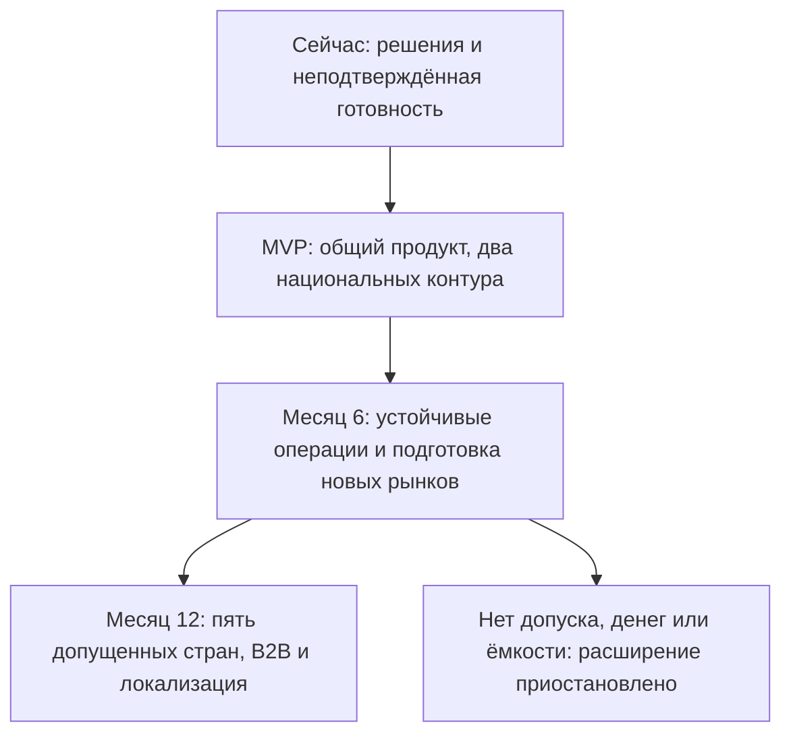

# Как MVP превращается в платформу пяти стран

**Сохраняем общий продукт и постепенно расширяем его возможности.** Для страны запускаем отдельную копию приложения и местные данные; не создаём новую кодовую базу под каждый рынок. Разделение на множество самостоятельных сервисов происходит по измеренной необходимости, а не по числу стран.

Основы: [Task2, Architecture Vision, раздел 2 «Устройство системы и ответственность»](../Task2/architecture-vision.md#2-устройство-системы-и-ответственность), [Task2, ADR №1, раздел «Late binding и проверка»](../Task2/adr-001-architecture-style.md#late-binding-и-проверка), [Task4, ADR №3, раздел «Обратимость решения»](../Task4/adr-003-data-residency.md).

## Состояния сейчас → MVP → 12 месяцев

| Область | Сейчас: подтверждённые входные сведения | MVP: проект к 15 октября | 12 месяцев: целевое состояние при выполнении условий |
|---|---|---|---|
| Продукт и код | Есть письма, проект архитектуры и лимиты; готовность реализации неизвестна | Go-приложение с модулями каталога, заказов, расчётов, доставки, уведомлений, доступа/отчётов; отдельный фоновый процесс | Те же модули и общий репозиторий; расширены кабинет продавца, возвраты, B2B и локализация. Отдельный сервис только там, где доказана польза |
| Страны | Не подтверждены договоры площадок и правовой допуск | Два национальных развёртывания NG/KE; одинаковая версия, разные настройки и доступы | Пять независимых национальных развёртываний; ZA и рынки 4/5 включаются после собственных проверок |
| Данные | Консервативная политика Task4 | PostgreSQL, файлы, журналы, копии и ключи внутри соответствующей страны; зарубежным сотрудникам безопасные показатели | Сохраняется национальная изоляция. Новые финансовые/налоговые сроки задаются политикой страны; общие отчёты только обезличенные |
| Платежи | Кандидаты M-Pesa/Flutterwave; тарифы и договоры не утверждены | Один разрешённый маршрут на страну, переходник, проверка подписи/повторов и сверка | Второй провайдер по выгоде/риску; старые попытки остаются у прежнего PSP. B2B использует тот же финансовый учёт; собственного кошелька/кредитования нет |
| Доставка | Sendbox/Sendy указаны в источниках; работоспособность KE не доказана | Договорный перевозчик, API либо согласованный ручной обмен в стране, статусы и контролируемая выдача | Больше перевозчиков, подробные статусы/возвраты; переходники подключаются к той же модели заказа. Видео лишь после отдельного допуска |
| Каналы | Недорогие Android и нестабильная сеть | Android с кешем публичного каталога, мобильный веб, SMS; персональные данные/оплата не считаются корректными по кешу | Языки и WhatsApp/USSD по допуску; iOS по спросу. Полный offline-платёж не появляется из-за добавления USSD |
| Надёжность | Есть цели Task3, испытаний во входных данных нет | Две копии приложения, резерв БД, местная запасная площадка; 99,9% как согласуемая цель, а не полученная гарантия | Больше мощности/резервов по нагрузке и цене; повышение SLO отдельным решением с финансированием |
| Расходы и обслуживание | Шесть контракторов; новых людей не разрешено нанимать | $3 950 регулярной техники при 2 000 заказов, труд/разовые отдельно; дежурства по вызову | Бюджет и ёмкость подтверждены перед расширением. $31 900 техники из сценария Task2 не становится разрешением на закупку |

## Что закладываем сразу, чтобы избежать полного переписывания

1. **Чёткие владельцы данных.** Каталог управляет товаром, заказ — покупкой, расчёты — финансовым результатом. Другой модуль обращается через согласованную операцию, а не произвольно меняет чужие записи. В MVP это вызовы внутри одного приложения.
2. **Переходники партнёров.** Общие операции «начать оплату», «проверить результат», «передать доставку» отделены от формата конкретного PSP/перевозчика. Партнёр меняется вместе с переходником и договором, а не вместе со всем заказом.
3. **Настройки страны.** Валюта, язык, допустимые партнёры, роли, согласия и сроки хранения задаются отдельной проверенной конфигурацией. Не определяем страну субъекта только по сетевому адресу.
4. **Надёжные фоновые операции.** Событие сохраняется вместе с заказом в PostgreSQL. Отправитель повторяет его с прежним номером; получатель распознаёт повтор. Когда появится отдельный сервис, используется тот же смысл сообщения, но уже между процессами. Термин из Task2 «outbox» означает этот журнал ожидающих отправки событий.
5. **Совместимые изменения.** Сначала добавляем новое поле/возможность чтения, затем переводим пользователей, старое удаляем после завершения перехода. Старые заказы остаются читаемыми. Нельзя удалять нужные поля вместе с откатом версии приложения.
6. **Воспроизводимая среда.** Контейнеры и автоматическая настройка позволяют развернуть ту же версию на разрешённом другом поставщике. Переносимость проверяем на тестовых данных за два рабочих дня по [Task3, NFR-17](../Task3/nfr-registry.md#реестр); это не обещание мигрировать живую базу за два дня без подготовки.

## Как переносим или выделяем часть системы

На месяце 6 сначала измеряем узкое место. Например, отправка сообщений мешает оплате: увеличиваем отдельный фоновый процесс и ограничиваем обращения к партнёру. Если этого недостаточно, выделяем уведомления в отдельный процесс/сервис, сохранив договор событий и национальное хранение.

Переход выполняется в одной стране на тестовой среде, затем на небольшой доле разрешённой нагрузки. Сравниваем результаты со старой реализацией; только одна версия выполняет денежные действия. После сверки переключаем новые операции, сохраняем обработку старых и возможность возврата. Граница переключения записана; два независимых владельца одной финансовой записи не появляются.

Новый рынок проходит повторяемый пакет: заключение юриста → местные площадки/ключи → договоры PSP/доставки → настройки валюты/языка → тесты оплаты/возврата/резерва → обученные операторы → решение CEO/CFO/CTO. Для Ганы/Кот-д’Ивуара необходима новая оценка: Task4 проверял только NG/KE/ZA.

## Какие решения откладываем и до какого события

| Решение | Когда возвращаемся | Что должно быть доказано |
|---|---|---|
| Несколько платёжных маршрутов и своя оркестрация | Через 90 дней пилота | Экономия комиссий/потерь больше стоимости разработки/поддержки; новые договоры законны |
| Выделение модуля в сервис | После настройки и проверки нагрузки | P99 не проходит целевой профиль либо две команды теряют >20% времени на общий выпуск; отдельная эксплуатация профинансирована |
| Kubernetes / mesh / Kafka | При существенном росте числа самостоятельно обслуживаемых процессов | CTO доказывает эксплуатационную выгоду и наличие ≥2 обученных специалистов. Ориентир Task2 — ≥10 процессов; пять копий одного приложения не требуют автоматического перехода |
| Oracle | После доказанного ограничения PostgreSQL | Испытание, лицензирование, полный расчёт цены и согласование CFO |
| Одновременная запись из двух площадок | После утверждённого сценария и бюджета | Согласованность финансов, законное размещение, фактический тест разделения сети |
| Видео, ML, кошелёк, рассрочка | Не раньше отдельной оценки месяца 12 | Право, данные, операционная польза, капитал и финансирование |

**Отложено не означает бесплатно.** В [Excel Task2](../Task2/tco-model.xlsx), «Контроль», C19 и TCO, G45, уже заложено **$120 000 на выделение сервисов в год 3** сверх обычного труда. Если миграция нужна раньше, CFO переносит/уточняет бюджет; этот roadmap не расходует будущую сумму сейчас.

## Assumptions

Общие модели и переходники уменьшают объём переделки, но не отменяют миграции данных, обучение и двойную временную среду. Новая норма закона может потребовать изменения кода; обратимость означает ограниченную контролируемую переделку, а не обещание «никаких изменений». Пять стран/миллион пользователей — цель при допуске, финансировании и подтверждённой ёмкости команды. Критерии качества остаются из [Task3, реестра НФТ](../Task3/nfr-registry.md), сценарии восстановления — из [Task4, плана отказоустойчивости](../Task4/failover-plan.md).
